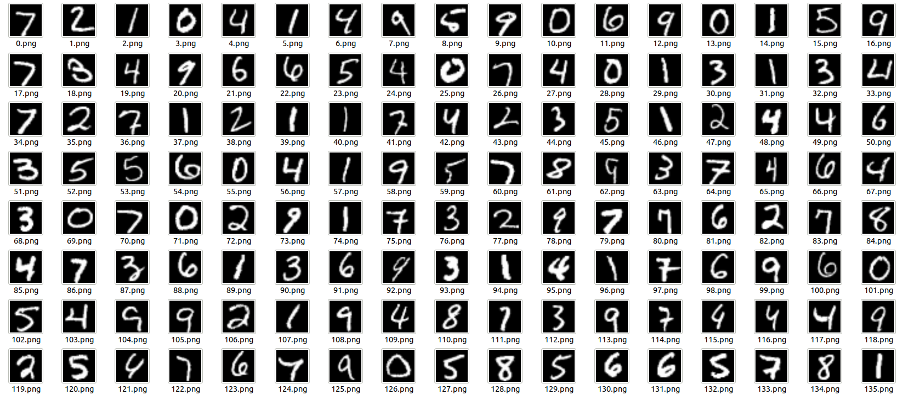
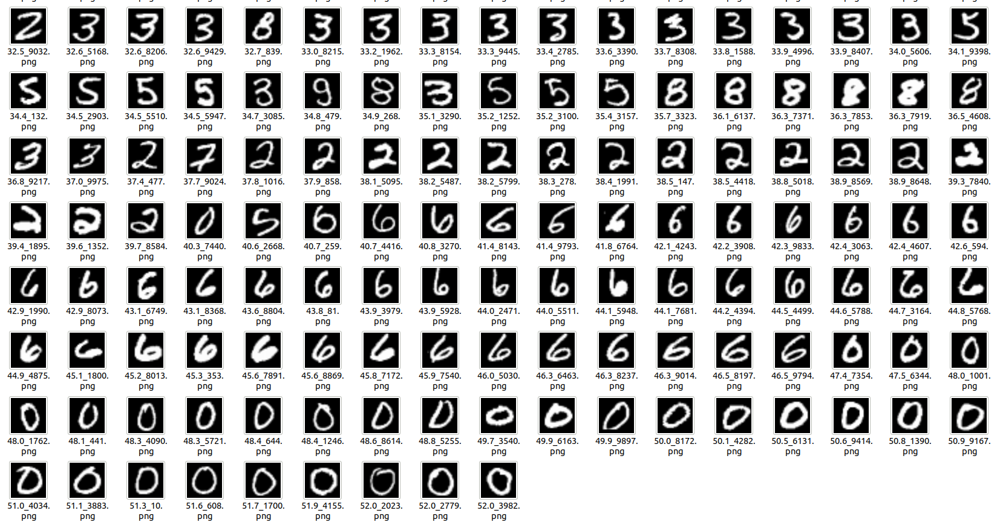

# 1D t-SNE pytorch Implementation with CUDA
`pytorch` implementation of algorithm described in [Visualizing Data using t-SNE](https://lvdmaaten.github.io/publications/papers/JMLR_2014.pdf). This code support cuda accelerating.

Sort a set of images by providing input and output directory and a featuretype (histogram or pixelvalues)

## How to use it

```bash
python tsne_torch.py --indir ../Pictures/mnist/in --outdir ../Pictures/mnist/sorted --function tsne --max_iter 300 --dims 1 --nrimgs 400 --feattype pix --cuda 1
```


## Requirements
* pytorch
* matplotlib, numpy


## Example
This is our result compare to result of python implementation.
* input folder


* output folder




## Credit
This code highly inspired by 
* author's python implementation code [here](https://lvdmaaten.github.io/tsne/).
